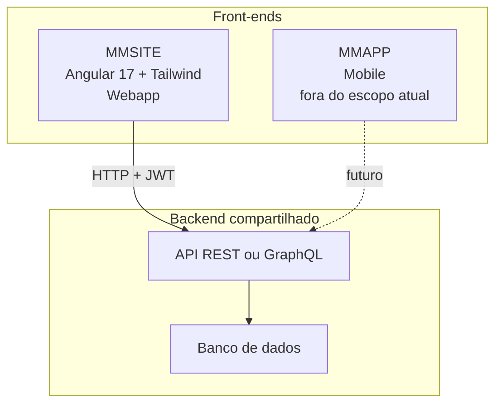
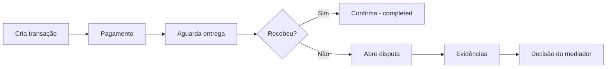

# Plano geral de desenvolvimento — MM-OneFactory (Middleman / Escrow)

Este documento consolida o plano de desenvolvimento da plataforma de intermediação, alinhado ao SDD [`frontend_sdd_middleman_angular.md`](./frontend_sdd_middleman_angular.md), com decisões de stack e escopo atualizadas.

**Última atualização:** 2026-04-08

---

## 1. Escopo atual e o que fica de fora

| Item | Situação |
|------|----------|
| **MMSITE** (webapp Angular) | **Foco imediato** — implementação e documentação detalhada |
| **MMAPP** (aplicativo mobile) | **Não iniciar por enquanto** — pasta reservada; mesmo backend/API quando existir |
| **Backend / API / banco** | Compartilhado entre MMSITE e MMAPP no futuro; contratos documentados em `docs/shared/` quando forem formalizados |

---

## 2. Visão da plataforma (dois front-ends, um backend)

Dois projetos front-end **independentes** consumirão o **mesmo backend e APIs** (quando o mobile for iniciado).



---

## 3. Ajustes em relação ao SDD original

- **UI:** Tailwind CSS no lugar de Angular Material + SCSS (no webapp).
- **Angular:** componentes **standalone** (Angular 17+), sem depender de NgModules para novas features.
- **Estado:** NgRx (Store, Effects, Selectors) para fluxos críticos de transação/escrow, conforme complexidade do produto.

---

## 4. Stack — MMSITE (webapp)

- Angular 17+ (standalone, Signals onde fizer sentido)
- TypeScript 5+
- Tailwind CSS 3+
- RxJS 7+
- NgRx 17+
- Angular Router com lazy loading por feature

---

## 5. Stack — MMAPP (mobile, futuro)

**Não definida neste plano.** Candidatos futuros: React Native + NativeWind, Ionic + Angular, Flutter, etc. A escolha será documentada quando o MMAPP entrar no roadmap.

---

## 6. Estrutura de repositório sugerida

```
MM-OneFactory/
  MMSITE/                    # Webapp Angular (trabalho atual)
  MMAPP/                     # Reservado — sem iniciar implementação por ora
  docs/
    PLANO_GERAL.md           # Este documento
    README.md                # Índice da documentação (opcional)
    shared/
      api-contracts.md       # Contratos de API e modelos (quando existir backend estável)
    webapp/                  # Documentação específica do MMSITE (a criar conforme necessidade)
      00-overview.md
      01-architecture.md
      02-project-structure.md
      03-design-system.md
      04-routing.md
      05-state-management.md
      06-auth.md
      07-dashboard.md
      08-transaction.md
      09-dispute.md
      10-phases.md
```

---

## 7. Estrutura interna sugerida — MMSITE

```
MMSITE/src/app/
  core/
    services/          # ApiService, AuthService, TransactionService, etc.
    interceptors/      # JwtInterceptor, ErrorInterceptor
    guards/            # AuthGuard, RoleGuard (se aplicável)
    models/            # Interfaces TypeScript (alinhadas a docs/shared/api-contracts.md)
  shared/
    components/        # Button, Input, Modal, StatusBadge, Loader
    pipes/
    directives/
  features/
    auth/              # login, register
    dashboard/         # lista de transações
    transaction/       # criar, detalhe
    dispute/           # formulário, detalhe
  layout/
    navbar/
    sidebar/
```

---

## 8. Rotas alvo (SDD)

| Rota | Feature |
|------|---------|
| `/login` | Auth |
| `/register` | Auth |
| `/dashboard` | Dashboard |
| `/transaction/create` | Transaction |
| `/transaction/:id` | Transaction |
| `/dispute/:id` | Dispute |

Lazy loading por feature, conforme padrão do SDD.

---

## 9. Contratos de API compartilhados (futuro)

Quando o backend estiver estável, documentar em `docs/shared/api-contracts.md`:

- Modelos: `User`, `AuthResponse`, `Transaction`, `Dispute`, `Evidence`, etc.
- Endpoints exemplares: `POST /auth/login`, `GET /transactions`, `POST /transactions`, `POST /disputes`, etc.

O MMSITE replica essas interfaces em `core/models/` para manter aderência ao contrato.

---

## 10. Fluxo principal de escrow (produto)



---

## 11. Status de transação e cores (Tailwind)

| Status | Sugestão de classes |
|--------|---------------------|
| `pending` | `text-gray-500 bg-gray-100` |
| `paid` | `text-blue-600 bg-blue-100` |
| `completed` | `text-green-600 bg-green-100` |
| `dispute` | `text-red-600 bg-red-100` |

---

## 12. Fases de desenvolvimento — MMSITE

1. **Fase 1 — Setup:** Angular CLI, Tailwind, pastas base, store NgRx inicial (se adotado desde o início).
2. **Fase 2 — Core:** `ApiService`, interceptors JWT, `AuthGuard`, modelos TypeScript.
3. **Fase 3 — Auth:** login, registro, fluxo JWT e persistência segura do token.
4. **Fase 4 — Dashboard:** lista de transações, filtros por status, badges.
5. **Fase 5 — Transaction e Dispute:** criar transação, detalhe, fluxo de compra e disputas.
6. **Fase 6 — Polish:** skeleton loaders, feedback (snackbar/toast), testes relevantes, build de produção.

---

## 13. Segurança, performance e UX (SDD)

- JWT via interceptor; rotas protegidas com guard.
- Sanitização de inputs; evitar XSS em conteúdo dinâmico.
- `ChangeDetectionStrategy.OnPush` onde aplicável; `trackBy` em listas.
- Design limpo estilo marketplace; mobile-first com grid/flex.

---

## 14. Build e deploy (referência)

- Build produção: `ng build --configuration production`
- Opções de hospedagem citadas no SDD: Firebase Hosting, AWS S3 + CloudFront.

---

## 15. Próximos passos sugeridos

1. Inicializar o projeto Angular em `MMSITE/` (quando for codar).
2. Preencher `docs/shared/api-contracts.md` assim que a API real existir ou um OpenAPI estiver disponível.
3. Detalhar cada área em `docs/webapp/*.md` conforme a equipe for implementando.
4. **MMAPP:** sem ação até decisão explícita de iniciar o app mobile.

---

## 16. Checklist de documentação derivada (opcional)

- [ ] `docs/README.md` — índice e links rápidos
- [ ] `docs/shared/api-contracts.md`
- [ ] `docs/webapp/00-overview.md` … `10-phases.md`

Este plano geral permanece a **fonte única** para visão, escopo e decisões arquiteturais até revisões futuras.
